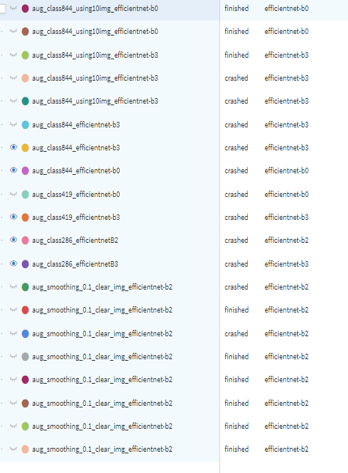

  

project with [ENDAND](https://endand.com/)

---

## LV_bag_classification  
루이비통 브랜드의 가방(약 850 종) 분류 프로젝트  
- 자세한 내용 : report.pdf
> _by. Experiment_

  
  

- 다양한 실험을 통해 모델 선정
  - 데이터 셋 : 직접 수집(크롤링), 약 13만 장 / 클렌징 약 8천 장
  - 사용 모델 : EfficientNetB0,B1,B2,B3,B4 / ViT
  - 전처리 및 증강법 변화
- 다양한 접근
  - objectdetection : YOLOv3 _for DataCleansing_
  - Classification, Metric Learning  
  
  
  
    
---
## DataSet
데이터 수집과 모델 학습을 동시에 전행하여 분류 가능 클래스가 점차 증가하였다. 수집된 데이터를 정제 후에 증강시켜 사용하였음.  
- 데이터 정제
  - 해시값을 이용한 중복 이미지 제거(sha256)
  - 정면에서 촬영된, 가방 객체 전체가 담긴 이미지 선별
- 데이터 증강
  - RandomCrop
  - RandomBrightnessContrast
- 최종적으로, 클래스당 10장의 이미지 사용

> 데이터셋 개요  

제품 수 |Class_81|Class_286|Class_480|Class_829
---|---|---|---|---
제품 당 이미지 개수|50|50|50|10
총 이미지 개수|4050|14300|24000|8290

> 클래스 별 모델 정확도
- 데이터 정제 전, 클래스 수에 따른 유의미한 성능 변화가 보이지 않는다.

제품 수 |Class_81|Class_286|Class_480
---|---|---|---
Top 1|36|41|41
Top 2| |54|54
Top 3| |60|60
Top 5|64|68|71

---
## Result
> 최종 모델 성능
- 정제 후 

제품 수 |Top 1|Top 2|Top 3|Top 5
---|---|---|---|---
Class_829|70.7472|82.349|86.607|88.942

  

## Contributors ✨

<table align="center">
  <tr>
    <td align="center"><a href="https://github.com/Tieck-IT"> <b>MinGyu Park</b></a> 
      <td align="center"><a href="https://github.com/Whizkid1"> <b>DongWon Sin</b>
      <td align="center"><a href="https://github.com/parkdonghwan97"> <b>DongHwan Park</b>
    <td align="center"><a href="https://github.com/DencioHR"> <b>Hyungjun Park</b>
  </tr>
</table>
